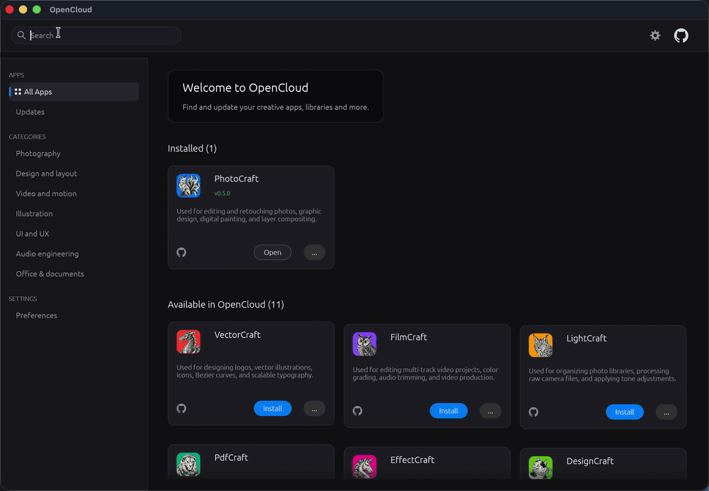

<div align="center" class="intro-header">

# OpenCloud

**a unified, native desktop application and suite manager (pure Rust) for the open-source StoryTold creative software family. 12 creative and productivity applications without webviews or electron runtimes.**

[](https://github.com/bshea-1/OpenCloud/releases) [](#installation)
[](https://opensource.org/licenses/MIT)

</div>

<div align="center">



</div>

----

## About OpenCloud

OpenCloud connects and coordinates independent open-source creative applications in one native desktop workspace:

- Native Performance: Built in pure Rust with hardware-accelerated rendering via `wgpu` and `egui`.
- Lightweight Footprint: Minimal memory usage (under 30 MB RAM) with fast startup times.
- Application Management: One-click installation, background update checks, and clean uninstalls.
- Offline Capability: Operates entirely locally with cached metadata and direct launch capabilities.
- Cross-Platform: Consistent interface across macOS, Windows, and Linux.

---

## Applications

The OpenCloud suite manages twelve independent open-source desktop applications:

| Application | Description | Repository |
| :--- | :--- | :--- |
| PhotoCraft | Professional raster image editing, layer stacks, non-destructive adjustments | [storytold/photocraft](https://github.com/storytold/photocraft) |
| VectorCraft | Vector graphic illustration, Bézier curve manipulation, typography | [storytold/vectorcraft](https://github.com/storytold/vectorcraft) |
| FilmCraft | Non-linear video editing, timeline sequencing, multi-track audio and video | [storytold/filmcraft](https://github.com/storytold/filmcraft) |
| LightCraft | RAW photo development, non-destructive color grading, photo management | [storytold/lightcraft](https://github.com/storytold/lightcraft) |
| PdfCraft | PDF inspection, document signing, page reorganization, document conversion | [storytold/pdfcraft](https://github.com/storytold/pdfcraft) |
| EffectCraft | Visual effects compositing, node-based motion graphics, visual rendering | [storytold/effectcraft](https://github.com/storytold/effectcraft) |
| DesignCraft | Desktop publishing, publication layout design, print-ready output | [storytold/designcraft](https://github.com/storytold/designcraft) |
| SoundCraft | Digital audio workstation (DAW), multi-track recording, mixing, mastering | [storytold/soundcraft](https://github.com/storytold/soundcraft) |
| CadCraft | Computer-aided 2D drafting and 3D parametric mechanical design | [storytold/cadcraft](https://github.com/storytold/cadcraft) |
| DeckCraft | Presentation authoring, slide layouts, presentation speaker mode | [storytold/deckcraft](https://github.com/storytold/deckcraft) |
| GridCraft | High-performance reactive spreadsheets, financial models, computational grids | [storytold/gridcraft](https://github.com/storytold/gridcraft) |
| WordCraft | Structured technical and document authoring, typography, styled output | [storytold/wordcraft](https://github.com/storytold/wordcraft) |

---

<a id="installation"></a>
## Installation & Downloads

Pre-built binaries are available for every major desktop platform on the [Releases](https://github.com/bshea-1/OpenCloud/releases) page:

- **macOS (Universal - Apple Silicon & Intel)**: Download `OpenCloud-1.0.0-macos-universal.dmg`. Open the disk image and drag OpenCloud into your Applications folder. (If prompted by Gatekeeper on first launch, right-click and choose **Open**, or run `xattr -cr /Applications/OpenCloud.app`).
- **Windows (x64)**: Download `OpenCloud.exe` directly or download `OpenCloud-1.0.0-windows-x64-portable.zip` and extract it. Double-click `OpenCloud.exe` to launch. (If prompted by Windows SmartScreen on first launch, click **More info** then **Run anyway**).
- **Linux (x86_64 AppImage)**: Download `OpenCloud-1.0.0-linux-x86_64.AppImage`. Make the file executable (`chmod +x OpenCloud-1.0.0-linux-x86_64.AppImage`) and run it.

### macOS Terminal Installation

You can install and launch OpenCloud directly from your terminal with a single command:

```bash
curl -fsSL -O "https://github.com/bshea-1/OpenCloud/releases/latest/download/OpenCloud-1.0.0-macos-universal.dmg" && \
hdiutil attach OpenCloud-1.0.0-macos-universal.dmg -mountpoint /Volumes/OpenCloud -nobrowse -quiet && \
cp -R /Volumes/OpenCloud/OpenCloud.app /Applications/ && \
hdiutil detach /Volumes/OpenCloud -quiet && \
rm -f OpenCloud-1.0.0-macos-universal.dmg && \
xattr -cr /Applications/OpenCloud.app && \
open /Applications/OpenCloud.app
```

<details>
<summary><b>Step-by-step terminal commands</b></summary>

```bash
# 1. Download the latest Universal DMG
curl -fsSL -O "https://github.com/bshea-1/OpenCloud/releases/latest/download/OpenCloud-1.0.0-macos-universal.dmg"

# 2. Mount the disk image
hdiutil attach OpenCloud-1.0.0-macos-universal.dmg -mountpoint /Volumes/OpenCloud -nobrowse -quiet

# 3. Copy to /Applications
cp -R /Volumes/OpenCloud/OpenCloud.app /Applications/

# 4. Unmount volume and clean up installer
hdiutil detach /Volumes/OpenCloud -quiet
rm -f OpenCloud-1.0.0-macos-universal.dmg

# 5. Clear Gatekeeper quarantine attribute
xattr -cr /Applications/OpenCloud.app

# 6. Launch OpenCloud
open /Applications/OpenCloud.app
```

</details>

> [!TIP]
> To batch-install all 12 StoryTold suite applications directly via terminal, run the automated macOS installer script:
> ```bash
> curl -fsSL https://raw.githubusercontent.com/bshea-1/OpenCloud/main/scripts/install-macos.sh | bash
> ```

All releases and release notes can be accessed directly at:
https://github.com/bshea-1/OpenCloud/releases

---

## Credits & Acknowledgments

OpenCloud is made possible by the following open-source projects and communities:

- [Rust](https://www.rust-lang.org/) - Empowering everyone to build reliable and efficient software.
- [egui](https://github.com/emilk/egui) / [eframe](https://github.com/emilk/egui/tree/master/crates/eframe) - Immediate mode GUI library for Rust by Emil Ernerfeldt.
- [wgpu](https://wgpu.rs/) - Safe, portable graphics library based on WebGPU API specification.
- [StoryTold](https://github.com/storytold) - Creators of the Craft creative software suite.

---

## License

OpenCloud is distributed under the MIT license.

---

## Star History

<div align="center">

<a href="https://star-history.com/#bshea-1/OpenCloud&Date">
 <picture>
   <source media="(prefers-color-scheme: dark)" srcset="https://api.star-history.com/svg?repos=bshea-1/OpenCloud&type=Date&theme=dark" />
   <source media="(prefers-color-scheme: light)" srcset="https://api.star-history.com/svg?repos=bshea-1/OpenCloud&type=Date" />
   
 </picture>
</a>

</div>
